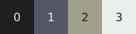

<div align="center">


# Litecanvas

[](https://www.npmjs.com/package/litecanvas/) &nbsp;
[](LICENSE)

Litecanvas is a lightweight HTML5 canvas 2D engine suitable for small web games, prototypes, game jams, animations, creative coding, learning game programming and game design, etc.

[](https://discord.com/invite/r2c3rGsvH3) &nbsp;
[](https://bills.itch.io/litecanvas) &nbsp;
[](https://litecanvas.js.org/)

</div>

<!-- prettier-ignore -->
> [!WARNING]
> **This project is still in the "alpha" stage. Break changes may occur frequently. All feedback is welcome and appreciated.**

### Features

- **Tiny**: Only `~4KB` (minified + gzipped).
- **Simple API**: Just few functions to draw shapes and some utilities.
- **Predefined colors**: Just use a number (from 0 to 11) to choose a color in our 12-color palette.
- **ZzFX**: Play or create sound effects with [ZzFX](https://killedbyapixel.github.io/ZzFX/).
- **Extensible**: Use or create [plugins](https://www.npmjs.com/search?q=keywords:litecanvas) to add functionalities or change the engine.
- **Playground**: Access or install the [playground](https://litecanvas.js.org/) webapp to code and share games (even offline).

## Getting Started

You can get started using our [online playground](https://litecanvas.github.io) without installing nothing.

If you want to test locally, just use one of the installation options.

### HTML/CDN

Create a HTML file and add a `<script>` tag with our CDN link:

```html
<script src="https://unpkg.com/litecanvas"></script>
```

### Template

For those who are familiar with Node/NPM, we have a [basic template](https://github.com/litecanvas/template).

## API

### Basic game structure

```js
litecanvas({
    // This is required only in ESM format.
    // Note: the next examples will assume that you are
    // testing through the playground or the CDN
    loop: { init, update, draw },
})

function init() {
    // this functions is called one time only
    // before the game starts
}

function update(dt) {
    // this functions is called 60 times per second
    // your game logic goes here
}

function draw() {
    // this functions is called 60 times per second
    // your game rendering goes here
}
```

> **Note**: if you installed via NPM you need to import the package first: <br/>
> `import litecanvas from "litecanvas"`

### Set the width and height of the game screen

```js
// example: a game screen size equal to 480x360
litecanvas({
    width: 480,
    height: 360,
})
```

### Colors

Litecanvas has a default palette with 12 colors:

| #   | Color      | #   | Color       |
| --- | ---------- | --- | ----------- |
| 0   | Black      | 6   | Dark blue   |
| 1   | Dark grey  | 7   | Light blue  |
| 2   | Light grey | 8   | Dark green  |
| 3   | White      | 9   | Light green |
| 4   | Red        | 10  | Brown       |
| 5   | Yellow     | 11  | Beige       |



Each time a Litecanvas' function ask for a color, you should use an of theses colors by its index.

```js
// example: draw a white rectangle
let color = 3
rectfill(0, 0, 32, 32, color)
```

### Printing messages

```js
litecanvas()

function draw() {
    // clear and fill the game screen with color #0 (black)
    cls(0)

    // print a red text at x=0, y=0
    text(0, 0, 'Hello!!!', 4)

    // use \n to break text lines
    text(0, 30, 'multi\nline\ntext')
}
```

[Live Demo](https://litecanvas.js.org?c=eJxVzEsKwkAMBuB9T%2FEXF52CYEG37j1EN3EadTBmZCb1gXh3pyqIIYs8PwnGnvRC2bVVtRvVW4iKIdHVtXhUKLFYwAtTAumAXRCBHRh7OjGyT8yKa7ADfJSYMOvgtkL%2B2L5%2FvWTXFfnrnFNQAyHxAONbKQ23dTfHfd29b6ahK33JZsMisa7rZo7Vjxgzo1dYxDYxHT%2BMBOX8Bywn4TSKhV6nba%2FTpmmr5wtwJEcj)


### Drawing shapes

You can use the following functions to draw shapes:

- `rect(x, y, width, height, color)` draw a rectangle outline
- `rectfill(x, y, width, height, color)` draw a color-filled rectangle
- `circ(x, y, radius, color)` draw a circle outline
- `circfill(x, y, radius, color)` draw a color-filled circle
- `oval(x, y, rx, ry, color)` draw a ellipse outline
- `ovalfill(x, y, rx, ry, color)` draw a color-filled ellipse

```js
litecanvas()

function draw() {
    cls(0)

    // draw a color filled rectangle at x=10 and y=20
    // with width=32 and height=32
    // and color=3 (white)
    rectfill(10, 20, 32, 32, 3)

    // draw a circle outline at x=64 and y=96
    // with radius=50
    // and color=5 (yellow)
    circ(64, 96, 50, 5)
}
```

[Live Demo](https://litecanvas.js.org?c=eJxljk0KwyAQhfc5xSwNBGJ%2BFLrwMKImCoOCMU1D6d2rabIoGZhBfeN7H7pklPRPuZC6qqbVq%2BSCBx3lRmp4V5BL4UJoVsu5bQ8NJKiAIcLkEI2GaFSSfkYDMsFLdBSk17CLnl6%2FNpdsHjpZMfSHao2bbcq3a6U8Hq5iALLZTFYfUjEvOaSjDfS5h%2F7sO5SLKkOENaHzJwwfT5gH%2F4OJUrt1EYze8xmQ3SCG7QdQXAkfG3jwBlgGYHX1%2BQLFaFeI)

### Drawing sprites

```js
litecanvas({
  width: 128
})

// you can create sprites with strings
// each visible char is a pixel
// numbers are colors
// dots are transparent pixels
let smile8x8 = `
    .555555.
    55555555
    55055055
    55055055
    55555555
    50555505
    55000055
    .555555.`

function draw() {
    cls(0)

    spr(
        0, 0,    // position X Y
        8, 8,    // the sprite Width and Height
        smile8x8 // the sprite Pixels
    )
}
```

[Live Demo](https://litecanvas.js.org?c=eJxtUMtqwzAQvOsr5mhDSNxCIBR67x%2B0vUWR1UigSEa7zoOQf%2B9KdkwPHfawuzOzSBM8W6PjWVNzV8DF9%2Bze8PK6U49Wqc0GtzRCBDDZaragIYuDRMgOxNnHIxWZ1cbh7MkfgoVxOsMTNAZ%2FtaHwcTwdbJZVFjqFlKurTzytOOtIg3SRJw%2BpYBl08nLuHXt5GrDeVqzrsJ0xD12t%2F4a%2Fsq603SITzMzz9F6pnzEa9imiz%2FrStLhXgQnUdJJI6SWDpjYF3aqU%2FGVI5KvvC98Lu1uVEnbKDZ8lX%2BjY48P6o%2BNFOP1UhOzsM4Gyb9XjF0Vyb7o%3D)

### Creating and drawing images

```js
litecanvas()

// lets create flag of Japan
let japanFlag = paint(
    48, 32, // the image width and height
    function () {
        cls(3) // white background
        circfill(24, 16, 8, 4) // red circle
    }, {
        // you can scale your image
        // by default, scale=1
        scale: 4
    }
)

function draw() {
    cls(0)

    // draw the japanFlag image
    image(
        W/2 - japanFlag.width/2,  // game screen center X
        H/2 - japanFlag.height/2, // game screen center Y
        japanFlag                 // the image
    )
}
```

[Live Demo](https://litecanvas.js.org?c=eJxtUctOwzAQvPsr5phIgdA0QgipV4T4AeC4dTaJi%2BtUjkNUof47toOcqmJPXs%2FMPma1cizJfNOY5UKUJTS7EdIyOUarqcPQ4o1OZIRHcAivl%2FC9w4mUcZmAj%2FqpwLYq4PWuZ6gjdYxZNa4HmQY9q653kdlORjo1GGQ5fuJPCKnHbJsH%2Bdz7gbAn%2BdXZYTLNSlFWtkrrrKoLbB4L%2BJZ1lFhuIqo5ki%2FFVWEPn4cJfkOMkjSHzC7zXXP2ZzTc0qRdsfB2mwTH%2FBn1Ulx4l9IOjaU57RF2ePDoX8mARTNWy9a28ZWlFu9lhbuVeB%2BdK72foVBHR%2FZDWGYDycaxxUdSvt4oF6fL5RT%2FKD%2BTch3rNq6PGOm5uPwCs6aXUg%3D%3D)

> Note: It's very useful when you need to draw something the same way every time. This way, you create an image of that drawing, working as a kind of cache.

You can also draw PNG/JPG image files, but you'll need to load them first:

```js
litecanvas()

let myImage

function init() {
    // load a image from its URL
    let img = new Image()
    img.onload = () => {
        myImage = img
    }
    img.src = 'https://litecanvas.js.org/icons/icon-128.png'
}

function draw() {
    cls(0)

    if (!myImage) {
        // if not loaded, show this message
        text(10, 10, 'Loading image...')
    } else {
        // when loaded, draw the image file
        image(0, 0, myImage)
    }
}
```

[Live Demo](https://litecanvas.js.org?c=eJxVkMFOwzAMhu95CnNqKo1044SQyh1pJyQeIGrTNih1ptpQEOq742RtGVGSg%2F37s38Hz66x%2BGlJl0oFxzB%2Bv4y2d0p1H9iwjwgePesSfhTIqSoI0bZgwScZdFMcwTPB2%2Bs5CxLDjz3UgG6GzBJ0ykjURMzVNQiwfl6Z6axtJSOyHF32IpoaiRcD84WeqirsM5t3MnHqK99EpPzfnx4ezQX7Qi03DtrJzruDJpA%2BitlM70Dfra3Lm2nEpaQwcjbr2gPQEGfgwROMjigtaNOy%2B2J9Oh4gveIseo%2F9dTvGmOLqfQEXyP3vMA8Od34aUfhuW6sPfx1ySAtd7jbsuqLlFwWNf7A%3D)

If you need to load multiple assets (images, fonts, music, etc.), I recommend you the [Asset Loader Plugin](https://github.com/litecanvas/plugin-asset-loader).

### Keyboard

```js
litecanvas()

function update() {
    if (iskeydown('space')) {
        // checks if the spacebar key is down
    }

    if (iskeypressed('a')) {
        // checks if the "a" key was pressed
    }

    // Returns the last key pressed in your keyboard.
    let key = lastkey()
}
```

> Note: you can call `iskeydown()` or `iskeypressed()` (without arguments) to check for any key.

### Clicks and Touches

```js
litecanvas()

let x, y

function tapped(tapX, tapY) {
    // this function is called when a click or a touch happens
    // tapX and tapY is where the tap happened
    x = tapX
    y = tapY
}

function draw() {
    cls(0)

    if (x != null) {
        // Draw a red circle wherever you tap
        circfill(x, y, 32, 4)
    }
}
```

### Mouse cursor

Use `MX` and `MY` variables (automatically declared by Litecanvas) to track the position of the mouse cursor.

```js
litecanvas()

function draw() {
    cls(0)

    // draw a red circle in the mouse cursor's position
    circfill(MX, MY, 32, 4)
}
```

### Litecanvas' variables

Like `MX` and `MY`, Litecanvas also declares these other variables:

- `W`: the width of the game canvas
- `H`: the height of the game canvas
- `T`: the amount of seconds since the game started
- `PI`: approximately 3.14 radians (or 180 degrees)
- `TWO_PI`: approximately 6.28 radians (or 360 degrees)
- `HALF_PI`: approximately 1.57 radians (or 90 degrees)

### And much more!

You can find a complete list of everything litecanvas has to offer on our [cheatsheet](https://litecanvas.js.org/about.html).

## Demos

Try some demos in the playground:

- [Bouncing Ball](https://litecanvas.js.org?c=eJxtksFygyAQhu8%2BxR7VmGjSdqZNag89%2BQaeGcAMM1QdRBsm8d27Co3Y9MAM7M%2F%2B%2By2L5BraphNaNDXkMHAa7rMswRUlAeBZNlRoM%2B3PigxuqwgTfYf3n1%2BDQArNKakH0oVREFR9TWczUQsdRnD1XDDhejmW8SExxyI9jKfF1UrZJGB49Hz6lhHNQ6at1y%2Fs7gKb%2FO6MpxiY9nWz0o3VPRhr4Mov%2BV6GJy%2FpaQqfDbJxaKoKODvzDqOignAh27j3%2BYASbjcPeeuEd8hsNyucOIft%2FvRPNNu9vcxhr%2FkcqCRfrVc1cWNJoHR1Ikwa%2F9JhX3DnKx4wzIzxWHGaUOF8Z1t%2FRkyRbzdrKrswi6YuqFC0ElL6iItd4mCfovW4px%2BIrRjrprjuVY1fAyNY8gdFptV%2F)
- [Scroller](https://litecanvas.js.org?c=eJxVUM1SgzAQvvMU68FpAhFDLVpH%2BxbOcOj0ECGUzATSIYsyOn13NwXRHpJNvv1%2BkrUGdam6D%2BUZj6J66Eo0rgPTGQTG4TsCaLX36qhhB6tC29K1GtCBXYQ3KyKN1C6onpSl034jcvEonsRWPItMiiw7ROd%2F9sOpUqiBVThFePMV%2FIv7OSu1ujtiQ52G4FxeAu528CAlxFDhHNiqkY0C1pJfuVe9%2Bvx9fGk9ozZA7XpgViMYEsoXKq9wnUZYkkwqgMBEYr4lTKZZbPiC0kLdh%2FRZ7Yd3jz0zArI%2FVumsCySax762zvUM4%2FyWbnMYP1yoqEcMn2dh4wvExsTEAYpluhXQJGuZeNORx4bHjZjfIKaUIDvTAH4AEIGEgw%3D%3D)
- [3D projection](https://litecanvas.js.org?c=eJyNVcuS2jAQvPsrJofUykE8wykJySlVyRckuy4fZGwWgZEpWQSWFP%2BeGUlgizVLqgyyprul1mgkl9IUc6H%2BiJrFUbTYqbmRlQKppGEx%2FI0AanksYAa%2F4Cv8gG%2F4G8IUPmEfW4S3uloVTjSDBAMAyZjDCJ%2BUuy6%2Bj8MuRWw3pREqqUzdqPs0I4d2k3IYDiE5cHjhcEwdr4vWRjqA%2Fj2kRQgHuwm8jvc7gbTJVZHTYikg1HNJyR1Fp1byd9tcmILlxm2AI%2FWQNRiNIwwsKg2sLAxIkn7G5otP4qAs1LNZYqjXc2KAeaVqgzhl2LImG2G0PLDBYOBUiUxjS6UxdWWEc4i0za5kNoC2fjNrJOY0luPf5D5euJ5yh%2F%2FUzb%2FkCx02oqbiAvopyGGuxd4X8Lys2SimxG139ZIRt5Sq2MvcLNmEukYLVZeUc6rqCbdFbpGuVE%2Bv06vQDZMcmIQejGN4D1PeeI9DGlIQZS1u7EK3BBxkB%2BFkD84WV9Ne9VkkOGTc14QzSitmfrtFmozoOTMoMA4C2TUjuzA%2BhjP6PaEJfbZtuYl5VVLBCdT4omwwXe0tdg1kXpR1iDIvys4AInIBzE30bjZzjBjMElvA7YXvWleaPfzEy62UObiqL%2BoHWwpuVF3U56PYtdPWabDbKHC1mLhL6KJaOdUKVXYZ%2BNqo3Mmqdxt71F3kolw75Zrmc8p1WwlW16NUyjRZp%2FAB87NOk1XqCSffOmsYx%2FFQEp2xEy1XF2anFXGC3WvOtha5xEPg5vXsm7f5vKovAns1qla3TQyRUDby12KXn8e3%2FFwNE85y45tz7TE084aTp%2F93cisP95Pw6qPYdhLc2f4LGJpJDngukxf6O6Yk%2FgdWEko3)
- [Rendering Benchmark](https://litecanvas.js.org?c=eJylVVtP2zAUfs%2BvsLpJSSCkSS9QurYTQkx7AAkB0x6qariJ21q4See40Az633dsp8G9UNDmB1Kf853j71yJ0iQTKEoTwVOWoS6K02g%2BJYnwI06wIBeMyJtjx%2FTRdq0V0KdJQvj3u6tLMLm3OqDtWQhOJwN9Mu6dTdN5ItqdanHXSowmnIy6la9YqbthEFR68KdTxW8gmhLR3IcAc%2Bnk4W1ETSFqexANhWjsQbQUorUHER5rIsd7MHVNpV5w6VRV3mT2UCZyRrqVWZpRQdOkjThhWNBHUil8RTh5xBmicbcSVXqdqr6vnNxbZeGGaZz7eDYjSeys6uVaG3r1nB%2BlLOVQQftTGIb2TsgQRw9jDuzj8xI8Go1sy2JEoDlnIEnIE%2Fpxc%2BmwNMKSvOspypmABgL1s7rJE6mmQIdg5mcE82hyjTmeZv6YQIvpJNkuenlBUFWvNHuisZi0QVZrvAonhI4n4KzRKpBLoEQF0Xlx9KOFpWLiq4vGroy1Qt%2B0Rpu3IcrItpaQNw3JZpyqYGaYwjgoaFjz1r79kpvtw2nAkV%2Fb25BjvEMeBFIeBFvymvRT25CfwKnDacJZkx8fn9TDsN4cDj8mf8OPfPcUzua7kudpq3W6zdP3pXxXvNKPIR%2Foz2tTZBFmpI3qqypCzkfzJJKNhGhCheMW4G%2FXt7%2BuLu4ubvyYZjOGc0fwOQF42Wx%2BRv%2FIIpk102XXoGoVQcMJGjGC1H6DN3TV1RqcFbqs6OkzzuER7Uy1rmuAYyqHoR966CgcKPkIxsORU0FBEXyBTwcZxiA4PHTXpkH6WQCYY5hVFx2YjYqOjJg2bPJtG93D%2B4z68cJDcT6QrEuVPMoTxFGX3iCsvhRQJ%2FBQ6A68f4EOyl9lSvtUPvyMgEMONBQVKLYuuVFBswblb8vIO6PJg%2Fl%2F6vec8PyWMBKJlDv3%2FfWN%2B%2FnZqMCyMrjXJaQjqBQ4Mssh78XSG8Ha%2FKkTCvtumLLYLpgujeaMOX4qmxNa65zBSkNiQoolokmzzAnc7fbDCZ3u67%2BNbPxHg3Ezk1AGq9Rzf4GOoJP8eGHI8kKWvwJluiS4gwLT%2F8oHkNmQxQt00IXBKMVLRFhGCkf5bkf5Lkf5pqNtVofm8PfMGdpN9t0h%2B1gMO5%2FVY7g7tvcH9QMxT%2FGYyKg96dRb23Ru2aN%2FASaYns8%3D)

> _See other demos in [samples](/samples) folder_

## Contributing

1. Fork this repository and clone it.
1. Install the dependencies: `npm i`
1. Create a new branch and make your changes.
1. Format the code: `npm run format`
1. Create new tests in `tests` directory, if necessary.
1. Test with `npm run test`
1. Create your pull request.
1. Done!

> Note: You'll need Node.JS installed in your machine.

## Inspirations

- [floppy](https://github.com/lpagg/floppy): a micro game engine for beginners.
- [PICO-8](https://www.lexaloffle.com/pico-8.php): fantasy console for making, sharing and playing tiny games.
- [js13kGames](https://js13kgames.com/): a JavaScript coding competition with size limit set to 13 kilobytes.
- [raylib](https://www.raylib.com/): a simple and easy-to-use gamedev library.
- [p5.js/Processing](https://p5js.org/): a library for creative coding.
- [Pygame Zero](https://github.com/lordmauve/pgzero): A zero-boilerplate games programming framework for Python 3.
