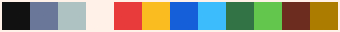

<div align="center">


# Litecanvas

[](https://www.npmjs.com/package/litecanvas/) &nbsp;
[](LICENSE)

Litecanvas is a lightweight HTML5 canvas 2D engine suitable for small web games, prototypes, game jams, animations, creative coding, learning game programming and game design, etc.

[](https://discord.com/invite/r2c3rGsvH3) &nbsp;
[](https://bills.itch.io/litecanvas) &nbsp;
[](https://litecanvas.js.org/)

</div>

<!-- prettier-ignore -->
> [!WARNING]
> **This project is still in the "alpha" stage. Break changes may occur frequently. All feedback is welcome and appreciated.**

### Features

- **Tiny**: Only `~4KB` (minified + gzipped).
- **Simple API**: Just few functions to draw shapes and some utilities.
- **ZzFX**: Play or create sound effects with [ZzFX](https://killedbyapixel.github.io/ZzFX/).
- **Extensible**: Use or create [plugins](https://www.npmjs.com/search?q=keywords:litecanvas) to add functionalities or change the engine.
- **Playground**: Access or install the [playground](https://litecanvas.js.org/) webapp to code and share games (even offline).

## Getting Started

You can get started using our [online playground](https://litecanvas.github.io) without installing nothing.

If you want to test locally, just use one of the installation options.

### HTML/CDN

Create a HTML file and add a `<script>` tag with one of our CDN links:

```html
// Unpkg
<script src="https://unpkg.com/litecanvas"></script>

// or jsDelivr
<script src="https://cdn.jsdelivr.net/npm/litecanvas"></script>
```

### Template

For those who are familiar with Node/NPM, we have a [basic template](https://github.com/litecanvas/template).

## API

### Basic game structure

```js
litecanvas({
    // This is required only in ESM format.
    // Note: the next examples will assume that you are
    // testing through the playground or the CDN
    loop: { init, update, draw },
})

function init() {
    // this functions is called one time only
    // before the game starts
}

function update(dt) {
    // this functions is called 60 times per second
    // your game logic goes here
}

function draw() {
    // this functions is called 60 times per second
    // your game rendering goes here
}
```

> **Note**: if you installed via NPM you need to import the package first: <br/>
> `import litecanvas from "litecanvas"`

### Set the width and height of the game screen

```js
// example: a game screen size equal to 480x360
litecanvas({
    width: 480,
    height: 360,
})
```

### Colors

Litecanvas has a default palette with 4 colors:



Each time a Litecanvas' function ask for a color, you should use an of theses colors by its index.

```js
// example: draw a white rectangle
let color = 3
rectfill(0, 0, 32, 32, color)
```

> Note: You can customize the color palette using the `pal()` function. [Example](samples/custom-palette/custom-palette.js)

### Printing messages

```js
litecanvas()

function draw() {
    // clear and fill the game screen with color #0 (black)
    cls(0)

    // print a gray (color #1) text at x=0, y=0
    text(0, 0, 'Hello!!!', 1)

    // use \n to break text lines
    text(0, 30, 'multi\nline\ntext')
}
```

> By default, the texts are white (color #3).

[Live Demo](https://litecanvas.js.org?c=eJxVjM2OwjAMhO99iqn20ERCoogz932IXkxwIcI4q8TlRyvenbSLtGLky8x4PonGgfRKxfmmGScNFpPikOnmPH4bVK3XCMKUQXrAGEVgJ8aRLowSMrPiFu2EkCRlfPVwe6Fw9ss2SHF9Jb85PzmqgXDM9IB7LzYexvcaG%2B67foXHrl%2F%2B59BVX6%2F7ZpHUtm23wuYfNxXGoLCEfWY6%2F2EkKpcPwHYmXCaxOOjcDjo3nW%2BeL%2BleSpw%3D)

### Drawing shapes

You can use the following functions to draw shapes:

- `rect(x, y, width, height, color)` draw a rectangle outline
- `rectfill(x, y, width, height, color)` draw a color-filled rectangle
- `circ(x, y, radius, color)` draw a circle outline
- `circfill(x, y, radius, color)` draw a color-filled circle
- `oval(x, y, rx, ry, color)` draw a ellipse outline
- `ovalfill(x, y, rx, ry, color)` draw a color-filled ellipse

```js
litecanvas()

function draw() {
    cls(0)

    // draw a color filled rectangle at x=10 and y=20
    // with width=32 and height=32
    // and color=3 (white)
    rectfill(10, 20, 32, 32, 3)

    // draw a circle outline at x=64 and y=96
    // with radius=50
    // and color=1 (gray)
    circ(64, 96, 50, 1)
}
```

[Live Demo](https://litecanvas.js.org?c=eJxljk0KwyAQhfc5xSwNBKL5gy48zKAmCqJgTNNQeveqTRYlwogzb3zvsyYqge6JK6mrat6ciMY7kAF3UsO7gnSEXQlNan63bdEAQXjrA8zGWiUhKBHRLVYBRnhxRgGdhIN39Pq1m6jTJaPmfVdUrcyiY%2BqulTwsrrwHsutEVhcpm%2BccwmgDXaq%2BO%2BsOZYJIEH6L1rgTZhpOmMf0BxNQmm3lI73nMyBLwOMXnz3JNDTwmBoYUzyrq88XCIBWlw%3D%3D)

### Drawing sprites

```js
litecanvas({
    width: 128,
})

// you can create sprites with strings
// each visible char is a pixel
// numbers are colors
// dots are transparent pixels
let smile = `
    .333333.
    33333333
    33033033
    33033033
    33333333
    30333303
    33000033
    .333333.`

function draw() {
    cls(0)

    spr(
        0,
        0, // position X Y
        smile // the pixels
    )
}
```

[Live Demo](https://litecanvas.js.org?c=eJxtUDFuwzAM3PWKG22gSNRmKQr0H80WRVZrAopkiHTSIsjfS8lO0KEHDkfeHSEqkgTv0tlxdzXAhQYZ3%2FD88mpuvTHbLX7yDDXAl%2BAkgKeiCVajjGAplL642oLzI87EdIwBfnQFxHCY6DvEqqf5dAxFR0XlHHNpqSHLMpLiEk%2FKkiwZNjEI%2BES67h0HfRqw2TVsWrNbsTa21X%2FNX5ut1D5silW5rz4Y8zknL5QThuIuXY9rM%2FjIndUfqVz%2FoGukwj7V0lumzNRyH9g%2F1OUAVWUM98PqvDe3Xw5%2FZEM%3D)

### Creating and drawing images

```js
litecanvas()

// lets create a flag of Japan
let japanFlag = paint(
    48,
    32, // the image width and height

    // we call theses operations once to create a image
    function () {
        // lets modify the litecanvas palette to white and red
        pal(['#fff', '#bd0029'])

        // lets draw the flag
        cls(0) // the white
        circfill(24, 16, 8, 1) // the sun

        // reset the palette
        pal()
    },
    {
        // you can scale your image
        // by default, scale=1
        scale: 4,
    }
)

function draw() {
    cls(0)

    // draw the our generated japanFlag image
    image(
        W / 2 - japanFlag.width / 2, // game screen center X
        H / 2 - japanFlag.height / 2, // game screen center Y
        japanFlag // the image
    )
}
```

[Live Demo](https://litecanvas.js.org?c=eJx9Uk1rwzAMvftXCHpIAtnaZmV0g17H2B%2FYxtjBdeTEw3WK4yyU0f8%2BRemclsJ88Yeenp6eZU1AJd23bNNMiPkcLIYWlEcZECRoKytoNLzIvXSCYvA1nJ6G5w3spXEhFUBrtc55vytyIJZQI5idrBB6U4YapCuhRlPVQTCMID2CktYO0BZbaPboZTCNo6NTCKGZVDAT5%2BnOqQEEaQY%2F%2FHJiY9m7pjT6wMVt7ItUUjAwY1%2BbgZDEeCxjOgHSj2SmtU5ySGbbcrEoHpLPTFwVKL3smX7wJUaVbdNF9tc215hixittrE2LVQ7L%2BxzWtEVs27mLIp6sCBw5ib7QmPHtOBp90f2h6chMBy05isPNn3l2wmwPUKKWnQ35iNssY5jvj7AaqY%2BCWo9ODz1Ht8dW4x9GP6apmOryKY01XmEOBdxM0NtxNOiVR6aSOzKE%2FhwdKHQBPbzF5Oer5HGa%2Fst%2Bj9mTuvPR5HAmjr8pYdU3)

> Note: It's very useful when you need to draw something the same way every time. This way, you create an image of that drawing, working as a kind of cache.

You can also draw PNG/JPG image files, but you'll need to load them first:

```js
litecanvas()

let myImage

function init() {
    // load a image from its URL
    let img = new Image()
    img.onload = () => {
        myImage = img
    }
    img.src = 'https://litecanvas.js.org/icons/icon-128.png'
}

function draw() {
    cls(0)

    if (!myImage) {
        // if not loaded, show this message
        text(10, 10, 'Loading image...')
    } else {
        // when loaded, draw the image file
        image(0, 0, myImage)
    }
}
```

[Live Demo](https://litecanvas.js.org?c=eJxVkMFOwzAMhu95CnNqKo1044SQyh1pJyQeIGrTNih1ptpQEOq742RtGVGSg%2F37s38Hz66x%2BGlJl0oFxzB%2Bv4y2d0p1H9iwjwgePesSfhTIqSoI0bZgwScZdFMcwTPB2%2Bs5CxLDjz3UgG6GzBJ0ykjURMzVNQiwfl6Z6axtJSOyHF32IpoaiRcD84WeqirsM5t3MnHqK99EpPzfnx4ezQX7Qi03DtrJzruDJpA%2BitlM70Dfra3Lm2nEpaQwcjbr2gPQEGfgwROMjigtaNOy%2B2J9Oh4gveIseo%2F9dTvGmOLqfQEXyP3vMA8Od34aUfhuW6sPfx1ySAtd7jbsuqLlFwWNf7A%3D)

If you need to load multiple assets (images, fonts, music, etc.), I recommend you the [Asset Loader Plugin](https://github.com/litecanvas/plugin-asset-loader).

### Keyboard

```js
litecanvas()

function update() {
    if (iskeydown('space')) {
        // checks if the spacebar key is down
    }

    if (iskeypressed('a')) {
        // checks if the "a" key was pressed
    }

    // Returns the last key pressed in your keyboard.
    let key = lastkey()
}
```

> Note: you can call `iskeydown()` or `iskeypressed()` (without arguments) to check for any key.

### Clicks and Touches

```js
litecanvas()

let x, y

function tapped(tapX, tapY) {
    // this function is called when a click or a touch happens
    // tapX and tapY is where the tap happened
    x = tapX
    y = tapY
}

function draw() {
    cls(0)

    if (x != null) {
        // Draw a white circle wherever you tap
        circfill(x, y, 32, 3)
    }
}
```

### Mouse cursor

Use `MX` and `MY` variables (automatically declared by Litecanvas) to track the position of the mouse cursor.

```js
litecanvas()

function draw() {
    cls(0)

    // draw a white circle in the mouse cursor's position
    circfill(MX, MY, 32, 3)
}
```

### Litecanvas' variables

Like `MX` and `MY`, Litecanvas also declares these other variables:

- `W`: the width of the game canvas
- `H`: the height of the game canvas
- `T`: the amount of seconds since the game started
- `PI`: approximately 3.14 radians (or 180 degrees)
- `TWO_PI`: approximately 6.28 radians (or 360 degrees)
- `HALF_PI`: approximately 1.57 radians (or 90 degrees)

### And much more!

You can find a complete list of everything litecanvas has to offer on our [cheatsheet](https://litecanvas.js.org/about.html).

## Demos

Try some demos in the playground:

- [Bouncing Ball](https://litecanvas.js.org?c=eJxtksFygyAQhu8%2BxR7VmGjSdqZNag89%2BQaeGcAMM1QdRBsm8d27Co3Y9MAM7M%2F%2B%2By2L5BraphNaNDXkMHAa7rMswRUlAeBZNlRoM%2B3PigxuqwgTfYf3n1%2BDQArNKakH0oVREFR9TWczUQsdRnD1XDDhejmW8SExxyI9jKfF1UrZJGB49Hz6lhHNQ6at1y%2Fs7gKb%2FO6MpxiY9nWz0o3VPRhr4Mov%2BV6GJy%2FpaQqfDbJxaKoKODvzDqOignAh27j3%2BYASbjcPeeuEd8hsNyucOIft%2FvRPNNu9vcxhr%2FkcqCRfrVc1cWNJoHR1Ikwa%2F9JhX3DnKx4wzIzxWHGaUOF8Z1t%2FRkyRbzdrKrswi6YuqFC0ElL6iItd4mCfovW4px%2BIrRjrprjuVY1fAyNY8gdFptV%2F)
- [Scroller](https://litecanvas.js.org?c=eJxVUM1uhCAQvvsU00OzgNSi202atPsWTTxs9kAVVxKUjYytabPv3mG1tnuAgW%2B%2BHxhn0VS6%2F9CB8SRpxr5C63uwvUVgHL4TgM6EoE8G9rApjat8ZwA9uFV4tyHSRO2S6lk7Oh1yWcjtMbn8sxzPtUYDrMbZNtiv6Fk%2BLv6ZM%2F0JW%2Bq0BO%2FU1fRhD1ulQECNS0inJzZJKBS%2Fca8H%2Ffn74MoFRm2Axg%2FAnEGwJFQvVF7hNo2wNJ1VAJGJxHxLmcpyYfmK0kIzxPRFHcb3gAOzEvI%2FVuWdjySawaFx3g8Mxe6ebksYP16paCaMn2dx4yvEptSKCAmVPUto00Klwfbk8cRFK5c3yDklyi40gB98w4Iz)
- [3D projection](https://litecanvas.js.org?c=eJyNVcuS2jAQvPsrJofUykE8wykJySlVyRckuy4fZGwWgZEpWQSWFP%2BeGUlgizVLqgyyprul1mgkl9IUc6H%2BiJrFUbTYqbmRlQKppGEx%2FI0AanksYAa%2F4Cv8gG%2F4G8IUPmEfW4S3uloVTjSDBAMAyZjDCJ%2BUuy6%2Bj8MuRWw3pREqqUzdqPs0I4d2k3IYDiE5cHjhcEwdr4vWRjqA%2Fj2kRQgHuwm8jvc7gbTJVZHTYikg1HNJyR1Fp1byd9tcmILlxm2AI%2FWQNRiNIwwsKg2sLAxIkn7G5otP4qAs1LNZYqjXc2KAeaVqgzhl2LImG2G0PLDBYOBUiUxjS6UxdWWEc4i0za5kNoC2fjNrJOY0luPf5D5euJ5yh%2F%2FUzb%2FkCx02oqbiAvopyGGuxd4X8Lys2SimxG139ZIRt5Sq2MvcLNmEukYLVZeUc6rqCbdFbpGuVE%2Bv06vQDZMcmIQejGN4D1PeeI9DGlIQZS1u7EK3BBxkB%2BFkD84WV9Ne9VkkOGTc14QzSitmfrtFmozoOTMoMA4C2TUjuzA%2BhjP6PaEJfbZtuYl5VVLBCdT4omwwXe0tdg1kXpR1iDIvys4AInIBzE30bjZzjBjMElvA7YXvWleaPfzEy62UObiqL%2BoHWwpuVF3U56PYtdPWabDbKHC1mLhL6KJaOdUKVXYZ%2BNqo3Mmqdxt71F3kolw75Zrmc8p1WwlW16NUyjRZp%2FAB87NOk1XqCSffOmsYx%2FFQEp2xEy1XF2anFXGC3WvOtha5xEPg5vXsm7f5vKovAns1qla3TQyRUDby12KXn8e3%2FFwNE85y45tz7TE084aTp%2F93cisP95Pw6qPYdhLc2f4LGJpJDngukxf6O6Yk%2FgdWEko3)
- [Rendering Benchmark](https://litecanvas.js.org?c=eJylVFFv2jAQfs%2Bv8NikJAUCtLSqGDBVVadNaqWq7bQHhFbXMWDV2MwxLVnLf9%2FZDqlLKa22PAR8993lu7vvTKTINCJSaCV5hnoolWQ%2BpUInRFGs6Qmn5hSFKbsL42AFTJgQVH27OjuFkOugC95%2BgODpZuAX4%2F7RVM6F7nQbxdk5MZooOupVvmDr7rWazUofXt0GfgWxbxD72xAQbpLcvo7YtYjdLYi2RbS3IA4t4nALonXgiBxswew5KnsFl27D9s10D2U657RXmcmMaSZFBynKsWZ3tFLkIljc4QyxtFchlX634c6rJNdBObgbmeYJns2oSKPVvOJgzW8%2FlxDJpYIJhh9brVa4EXKDye1YAfv0uASPRqMwCDjVaK44WAS9Rz8uTiMuCTbk45qlnGkQELgf7Mk8xIoCVSEsyShWZHKOFZ5myZiCxFyTwhg9PiKYaq0Mu2epnnTAttt%2BMk4oG08gWfvQQ2bsD%2B2gg7Y1LIEj09Q1KnIsilSWWmIPLniVzTncyXlceAfKJmGwhEaO5oKYKhETTEdxUR6xi8TlWBYN%2BT7FYxrF1mnMiRRc4hS8ENPrl11xX8xmitlmGWjBvozMFDF9bzDzEfuuH7STmRiHFmNfX88vf52dXJ1cJCnLZhznkVZzCnSNs9FA0GjNCKfI7jXQ91jPCl9WUD9SCuIdMTuy2AOnzIhg0Kqhemto7SOQRWTUwMDR%2FAw%2FXeQFg6FajZ%2BpwORZAFhh0GiMdvx5oPqqJTDLtZj8ZYwb1bagQbqooTQfGtalyzw2E9SxZ7JBWQNjYFGzhlrxsPYv0GH5r2zpgJkPPyDgkAMNS6WY7TJ4WpPEn0H5P%2FClxcStfz%2F%2FnlOVX1JOiZYquh48v2k%2BPXgTWFaG126EbASTgkT%2BOMy5WPYRXBc%2FXUNBbzeSp2HBdOnpPlX4vtQ9SOuYwyojPaHFrjjSPIv2CvmZr37wdR7D7abnSrxUJxZsuk2ea836D%2F0pv9EwpaD0q2SB6iC0JF14tryw5U9AU5cBd1HTz7%2FKAWTWbOkC7fRgb0rzElGe0SJRvjlRvilRvp7oJauqtxKo76%2FYZrJv7uD7atj4Wbelm2t7e4%2FfUbO9bKGOmklae3apxqWE%2FwKDkIFn)

> _See other demos in [samples](/samples) folder_

## Contributing

1. Fork this repository and clone it.
1. Install the dependencies: `npm i`
1. Create a new branch and make your changes.
1. Format the code: `npm run format`
1. Create new tests in `tests` directory, if necessary.
1. Test with `npm run test`
1. Create your pull request.
1. Done!

> Note: You'll need Node.JS installed in your machine.

## Inspirations

- [floppy](https://github.com/lpagg/floppy): a micro game engine for beginners.
- [PICO-8](https://www.lexaloffle.com/pico-8.php): fantasy console for making, sharing and playing tiny games.
- [js13kGames](https://js13kgames.com/): a JavaScript coding competition with size limit set to 13 kilobytes.
- [raylib](https://www.raylib.com/): a simple and easy-to-use gamedev library.
- [p5.js/Processing](https://p5js.org/): a library for creative coding.
- [Pygame Zero](https://github.com/lordmauve/pgzero): A zero-boilerplate games programming framework for Python 3.
